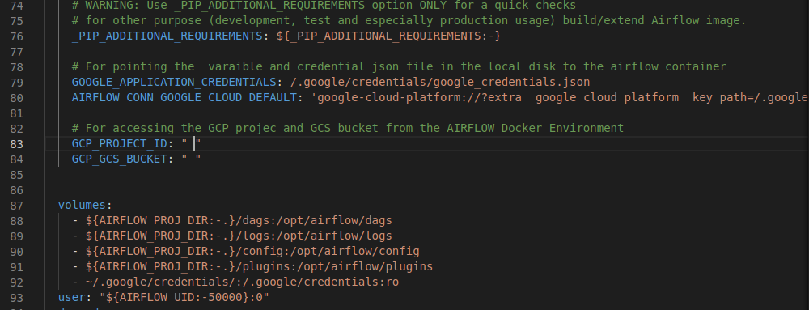

# EL_pipeline-with-Airflow

trash:///airflow_setup.md

## Overview
• An Extract and Load pipeline that gets NYC taxi data from DataTalks GitHub Repo and
loads it into GCS Bucket.

• It is scheduled to run monthly and will get the corresponding months data.

• The data pipeline is built in a Docker container and executed with Celery executor so it
makes the pipeline scalable.

## Setup (official)

### Requirements
1. Upgrade docker-compose version:2.x.x+
2. Allocate memory to docker between 4gb-8gb
3. Python: version 3.8+


### Set Airflow

1.  On Linux, the quick-start needs to know your host user-id and needs to have group id set to 0.
    Otherwise the files created in `dags`, `logs` and `plugins` will be created with root user.

2.  set your airflow user id using:

    ```bash
    echo -e "AIRFLOW_UID=$(id -u)" > .env
    ```

    For Windows same as above.

    Create `.env` file with the content below as:

    ```
    AIRFLOW_UID=50000
    ```

### SetUp GCP for Local System (Local Environment Oauth-authentication)
1. Create GCP PROJECT
2. Create service account: Add Editor and storage admin, storage object admins and bigquery admin
3. Create credential keys and download it
4. Change name and location
```bash
cd ~ && mkdir -p ~/.google/credentials/

mv <path/to/your/service-account-authkeys>.json ~/.google/credentials/google_credentials.json
```

   Below is an example
   
```
mv  /home/krissemmy/Downloads/alt-data-engr-1dfdbf9f8dbf.json ~/.google/credentials/google_credentials.json
```
4. Install gcloud on system : open new terminal and run    (follow this link to install gcloud-sdk : https://cloud.google.com/sdk/docs/install-sdk)

    ```bash
    gcloud -v
    ```
  to see if its installed successfully
5. Set the google applications credentials environment variable

  ```bash
  export GOOGLE_APPLICATION_CREDENTIALS="/path/to/.json-file"
  ```

  Below is an example

  ```bash
  export GOOGLE_APPLICATION_CREDENTIALS = "/home/krissemmy/.google/credentials/google_credentials.json"
  ```
6. Run gcloud auth application-default login
7. Redirect to the website and authenticate local environment with the cloud environment

## Enable API
perform the following on your Google Cloud Platform
1. Enable Identity  and Access management API
2. Enable IAM Service Account Credentials API


## Update docker-compose file and Dockerfile
1. Add google credentials "GOOGLE_APPLICATION_CREDENTIALS" and project_id and bucket name
    ```
        GOOGLE_APPLICATION_CREDENTIALS: /.google/credentials/google_credentials.json
        AIRFLOW_CONN_GOOGLE_CLOUD_DEFAULT: 'google-cloud-platform://?extra__google_cloud_platform__key_path=/.google/credentials/google_credentials.json'

        GCP_PROJECT_ID: "my-project-id"
        GCP_GCS_BUCKET: "my-bucket"
    ```
2. Add the below line to the volumes of the airflow documentation

    ```
    ~/.google/credentials/:/.google/credentials:ro
    ```
    

3. build airflow container image with:
```bash
docker-compose build
```
4. Initialize airflow db;
```bash
docker-compose up airflow-init
```
5. Initialize all the other services: 
```bash
docker-compose up
```
6. Inside plugins/web/operators folder is the python file with the WebToGCSOperator.
7. Inside dags folder is load_yellow_tx_web_to_gcs.py file with all the neccessary dag code, you can make modifications to the time schedules and any other thing you feel like
7. To check if all containers are running fine and healthy, open a new terminal run the below
```bash
docker ps
```
8. You can connect to your Airflow webserver interface at http://localhost:8080/
9. Default username and password is 

username : airflow

password : airflow

(you can change it in your compose file)

11. you can now run the dag
